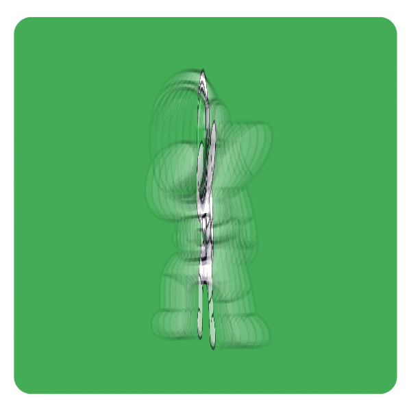

# Abogabot

_Como desarrolladores es necesario conocer los alcances del desarrollo de aplicaciones, por lo que, haremos la simulacion de la toma de requerimientos para crear una aplicacion que permite automatizar las demandas de los clientes de un despacho de abogados_

## Descripcion 🧑‍⚖️

* _La aplicacion debera automatozar las demandas de sus clientes, eso lo hara por medio de una pagina web._

* _Debe de llenar un formulario el cual le proporcionara un metodo de pago para finalizar su transaccion._

* _Los clientes podran crear una cuenta en la plataforma para ver el seguimiento y actualizaciones del proceso legal._

* _El administrador del site sera encargado de recibir notificaciones sobre nuevas demandas y con la informacion del formulario proporcionada por los clientes, se generara el documento legal para la demanda._

* _Por medio de un dashboard es posible que el administrador vea los pagos realizados y la cantidad de ingresos recibidos._

* _El administrador actualizara los procesos de demandas y agregara la informacion durante el proceso, a los clientes les llegaran correos de notificacion para saber los avances de su proceso._

* _La pagina debe ser responsive para que este disponible en cualquier dispositivo, los colores pueden considerarse como azul marino y blanco, aunque puede presentarse algunas propuestas._

### Practicas 📋

* Toma de requerimientos   
* Crear buyer persona  
* Publico objetivo  
* Crear Wireframe UX  
* Crear el UI

## Construido con 🛠️

_Para estas practicas se utilizaron los conocimientos vistos en el curso FrontEnd-Mision_

## Wiki 📖

Puedes encontrar mucho más de cómo utilizar este proyecto en nuestra [Wiki](https://github.com/LaunchX-InnovaccionVirtual/FrontEnd-Mision)

## Autores ✒️

_En esta ocacion el proyecto fue realizado de forma independiente_

* **Gualberto Montiel Diaz** - *Trabajo Inicial* - [gumodi35](https://github.com/gumodi35)

## Expresiones de Gratitud 🎁

* Esta practica sirve para conocer el proceso de desarrollo y los requerimientos para realizar una aplicacion web 📢
* Invita una cerveza 🍺 o un café ☕ a alguien del equipo.
* Gracias por fomentar el aprendizaje de tecnologias web 🤓.

---
⌨️ con ❤️ por [gumodi35](https://github.com/gumodi35) 😊